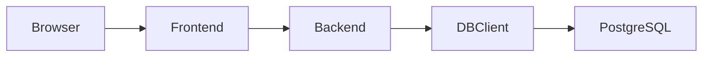

# Web Calculator on Microservices — Orchestrator

A compact **research bench** to run and compare different microservice implementations. This repo is the **single entry point** that wires services together via **Docker Compose**. All implementation details live in the component repositories.

## Repositories

* Orchestrator (this repo) — [https://github.com/rasnaut/WebCalculatorOnMicroServices](https://github.com/rasnaut/WebCalculatorOnMicroServices)
* Frontend (JS + Nginx) — [https://github.com/rasnaut/CalculaorJSFrontend](https://github.com/rasnaut/CalculaorJSFrontend)
* Backend (Java + Spring Boot) — [https://github.com/rasnaut/CalculatorJavaBackend](https://github.com/rasnaut/CalculatorJavaBackend)
* DB Client (Python + Flask/SQLAlchemy) — [https://github.com/rasnaut/CalculatorPythonPostgersClient](https://github.com/rasnaut/CalculatorPythonPostgersClient)

## Architecture (overview)



> Purposefully minimal: the orchestrator exposes **only the frontend**; other services communicate on an internal Docker network. See each component repo for exact configuration and rationale.

## Quick start

```bash
# Clone with submodules
git clone --recurse-submodules https://github.com/rasnaut/WebCalculatorOnMicroServices.git
cd WebCalculatorOnMicroServices

# Run
# Compose v2
docker compose up --build
# (or Compose v1: docker-compose up --build)
```

## Configuration

* **Compose files**: `docker-compose.yml` (authoritative source of service names, ports, networks)
* **Environment**: `.env` in this repo if used

## Submodules

```bash
# Initialize/update after clone
git submodule update --init --recursive

# Pull latest from submodules
git submodule update --remote --recursive
```

## Scope of this repo

**Contains**: Compose setup, submodule pointers, minimal run instructions.
